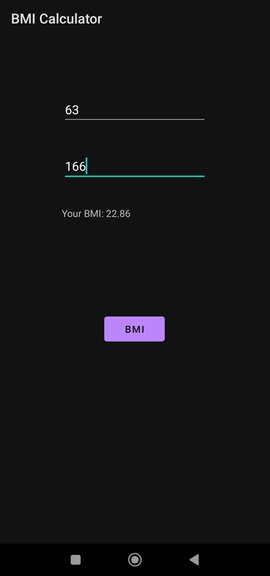

<h1 align="center">BMI Calculator</h1>

This Project is an `Android App`, where one can easily calculate his/her BMI.

## Built With

- [Android Studio](https://developer.android.com/studio)
- [Kotlin](https://developer.android.com/kotlin)

## Demonstration

### Show your support

Give a ⭐ if you like this PROJECT...🙂...!

If you are interested in this project and want to modify as your wish Or, you have an optimized version of this project  
then That will be great to merge up your new Features.
**PLEASE FEEL FREE TO CONTRIBUTE ON THIS PROJECT**

<h1 align="center" style="color: green">Thanks</h1>